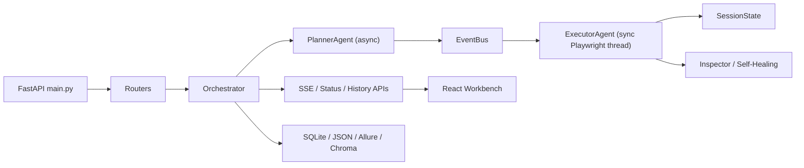

# Claw Architecture Blueprint v3

## Goal

Provide contributors with a system blueprint for the current project, emphasizing the actual runtime, capability boundaries, public protocols, and persistence locations.

## Core blueprint

## Runtime layers

- Entry layer: FastAPI routes, authentication, middleware, exception handling, SSE, and WebSocket
- Orchestration layer: `Orchestrator`, plan generation, task lifecycle, log streams, and result archiving
- Execution layer: `ExecutorAgent`, Playwright, action fallbacks, self-healing, and visual inspection
- State layer: `SessionState` is authoritative; `SharedBrowserState` provides compatibility
- Capability layer: exploration, release risk, execution center, deployment governance, specialized testing, and knowledge retrieval
- Presentation layer: React pages, service wrappers, Zustand state, and coordinated SSE and polling

## Key protocols

- `TaskEvent`: a task event sent from planning to execution
- `ResultEvent`: a result event returned from execution to orchestration
- SSE fields: `type`, `event`, `status`, `step_index`, `ui_track`
- Browser thread contract: `SessionState.run_browser()` uses a command queue to execute work on the browser thread

## Capability mapping

- Core orchestration: `core`, `plan`, `testing`, `history`, `report`
- Legions and batches: `commander`, `execution_center_service`, `LegionPage`
- Exploration and release: `exploration`, `release`, `quality_gate`
- Platform governance: `deploy`, `platform`, `notification`, `scheduler`, `cicd`
- Specialized testing: `graphql`, `grpc`, `database`, `mobile`, `security`, `accessibility`, `i18n`
- Knowledge and documents: `knowledge`, `document_analysis`, `document_bundle_analysis`

## Current design assessment

- The thread bridge between asynchronous planning and synchronous execution remains a core backend feature and should not be casually rewritten in the near term.
- `SessionState` is replacing the old globally shared state model. Current documentation must reflect this transition.
- The frontend has evolved from a single testing page into a workbench spanning several domains. Organize documentation by capability rather than by individual feature pages.
- `.agent/workflows/` has been removed, so repository support processes no longer depend on local workflow documents.
