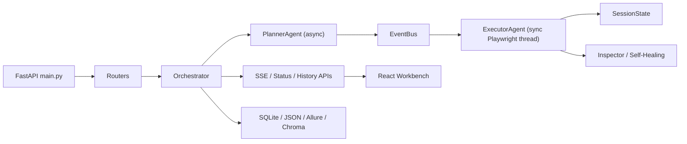

# Claw Architecture Blueprint v3

## 目标

给当前项目提供一份面向贡献者的系统蓝图，强调真实运行时、能力域边界、公共协议和持久化落点。

## 核心蓝图

## 运行时分层

- 接入层：FastAPI 路由、鉴权、中间件、异常处理、SSE、WebSocket
- 编排层：`Orchestrator`、计划生成、任务生命周期、日志流、结果归档
- 执行层：`ExecutorAgent`、Playwright、动作降级、自愈、视觉检查
- 状态层：`SessionState` 为主，`SharedBrowserState` 为兼容层
- 能力层：探索、发布风险、执行中心、部署治理、专项测试、知识检索
- 展示层：React 页面、服务封装、Zustand 状态、SSE 与轮询协同

## 关键协议

- `TaskEvent`：规划侧发往执行侧的任务事件
- `ResultEvent`：执行侧返回编排侧的结果事件
- SSE 字段：`type`、`event`、`status`、`step_index`、`ui_track`
- 浏览器线程契约：`SessionState.run_browser()` 通过命令队列切换到浏览器线程执行

## 能力域映射

- 核心编排：`core`、`plan`、`testing`、`history`、`report`
- 军团与批次：`commander`、`execution_center_service`、`LegionPage`
- 探索与发布：`exploration`、`release`、`quality_gate`
- 平台治理：`deploy`、`platform`、`notification`、`scheduler`、`cicd`
- 专项测试：`graphql`、`grpc`、`database`、`mobile`、`security`、`accessibility`、`i18n`
- 知识与文档：`knowledge`、`document_analysis`、`document_bundle_analysis`

## 当前设计判断

- 异步规划与同步执行的双线程桥接仍是后端核心特色，短期内不宜轻易改写
- `SessionState` 的引入正在替代旧的全局共享状态模型，这是当前文档必须优先反映的事实
- 前端已经从单一测试页演化成多域工作台，文档必须按能力域而不是按“单功能页面”组织
- `.agent/workflows/` 已经移除，因此仓库辅助流程不再依赖本地工作流文档

